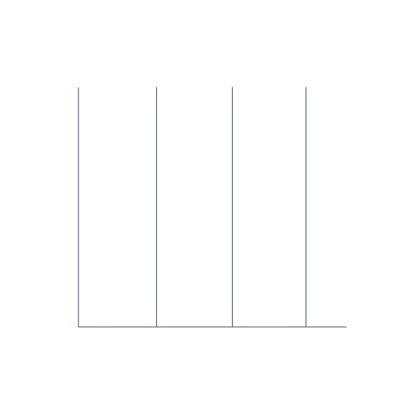

  <picture>
    <source media="(prefers-color-scheme: dark)" srcset="https://capsule-render.vercel.app/api?type=transparent&fontColor=703ee5&text=Hi%20there!%20I%20am%20Fan.&height=150&fontSize=60">
    
  </picture>

  

  

<h2>
  
  Skills & Technologies
</h2>
  

  
  
  
  
  
  
  

<h2>
  
  GitHub Analytics
</h2>
  

  
  

<h2>🎧 I'm listening</h2>

  

<h2>
  
  Contact Me
</h2>

  

  
  
  

